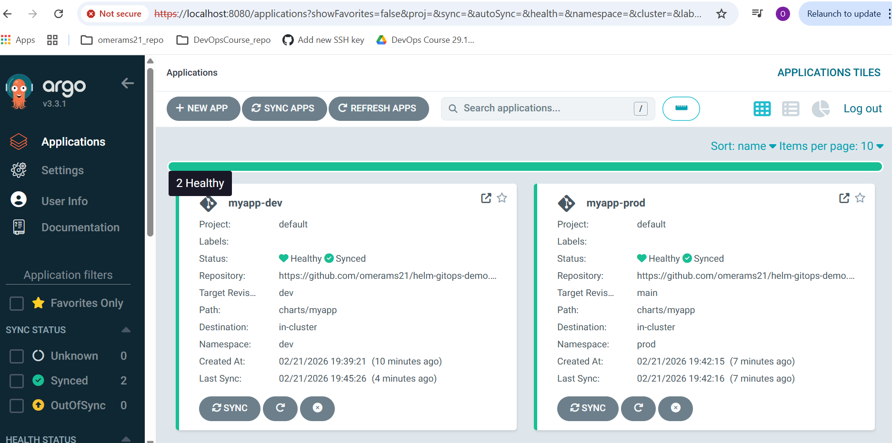
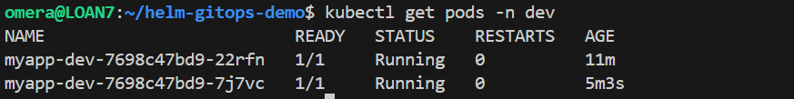
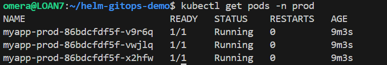

# Assignment 8 – ArgoCD + GitOps Helm Demo

## 📌 Repository Link

GitHub Repository:  
https://github.com/omerams21/helm-gitops-demo

---

# 🚀 Project Overview

This project demonstrates a complete GitOps workflow using:

- Kubernetes (Minikube)
- ArgoCD
- Helm
- GitHub (as the single source of truth)

Two environments are deployed using branch-based separation:

- dev → tracks `dev` branch
- prod → tracks `main` branch

Each environment uses a different Helm values file.

---

# 🏗 Repository Structure

helm-gitops-demo/
 ├── charts/
 │    └── myapp/
 │         ├── Chart.yaml
 │         ├── values.yaml
 │         ├── values-dev.yaml
 │         ├── values-prod.yaml
 │         └── templates/
 │              ├── deployment.yaml
 │              └── service.yaml
 ├── screenshots/
 └── README.md

---

# 📸 Screenshots

## ArgoCD UI – Applications Overview

---

## Dev Namespace Pods

Command used:

    kubectl get pods -n dev

---

## Prod Namespace Pods

Command used:

    kubectl get pods -n prod

---

# 🧠 Explanation

## 1️⃣ How ArgoCD Connects to GitHub

ArgoCD follows the GitOps principle where Git is the single source of truth.

When an Application resource is created:

- ArgoCD connects to the specified Git repository (repoURL).
- It monitors the selected branch (targetRevision).
- It watches the defined path inside the repository.
- It periodically pulls changes from Git.

In this project:

- The dev environment tracks the `dev` branch.
- The prod environment tracks the `main` branch.

Because the repository is public, no authentication credentials are required.

Any change pushed to Git automatically becomes the desired state of the cluster.

---

## 2️⃣ How Helm Rendering Works

When ArgoCD detects a Helm chart:

1. ArgoCD clones the repository.
2. It loads the specified Helm values file:
   - values-dev.yaml for dev
   - values-prod.yaml for prod
3. ArgoCD internally runs Helm template rendering.
4. Helm generates Kubernetes manifests (Deployment, Service, etc.).
5. ArgoCD sends the rendered manifests to the Kubernetes API.

Important:

Helm does NOT directly deploy resources.  
ArgoCD applies the rendered Kubernetes manifests to the cluster.

This ensures full GitOps compliance.

---

## 3️⃣ How Reconciliation Works

ArgoCD continuously compares:

- Desired State (Git repository)
- Live State (Kubernetes cluster)

If differences (drift) are detected:

- ArgoCD automatically synchronizes the cluster.
- automated sync enables continuous deployment.
- selfHeal: true restores manual changes made directly in the cluster.
- prune: true removes resources deleted from Git.

### Reconciliation Demonstration

In the dev environment:

The replicaCount was changed from:

    replicaCount: 1

to:

    replicaCount: 2

After committing and pushing to the dev branch:

    git push origin dev

ArgoCD automatically detected the change and scaled the deployment to 2 pods without manual intervention.

This demonstrates:

- Continuous monitoring
- Automatic synchronization
- Git as the single source of truth

---

# ✅ Final Result

✔ Branch-based environment separation  
✔ Automated synchronization  
✔ Helm-based deployments  
✔ Continuous reconciliation  
✔ Full GitOps workflow implemented successfully

